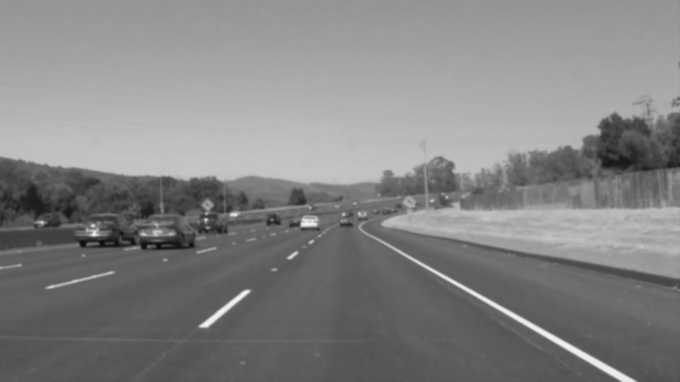
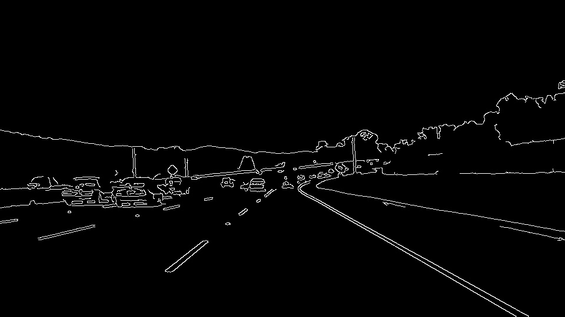
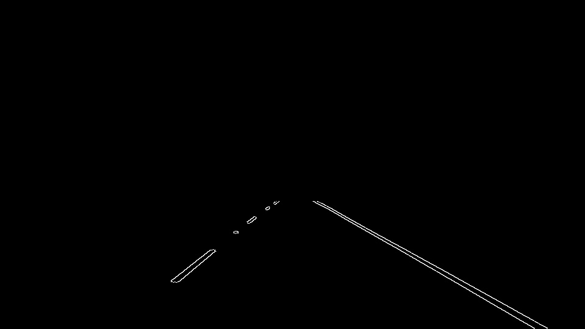
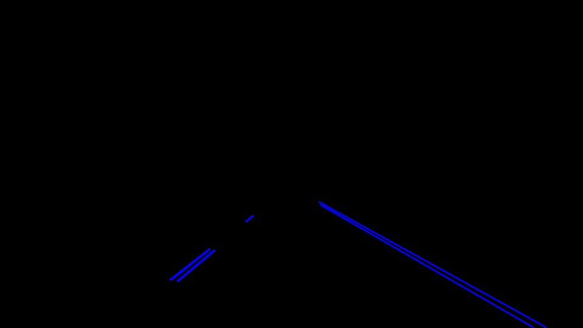
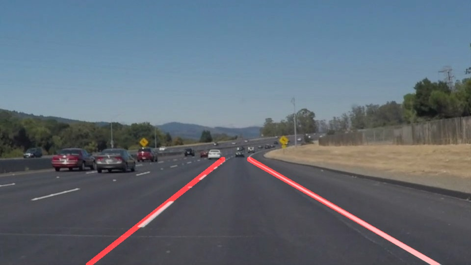

# **Finding Lane Lines on the Road** 

## Writeup Template

### You can use this file as a template for your writeup if you want to submit it as a markdown file. But feel free to use some other method and submit a pdf if you prefer.

---

**Finding Lane Lines on the Road**

The goals / steps of this project are the following:
* Make a pipeline that finds lane lines on the road
* Reflect on your work in a written report

[//]: # (Image References)

[image1]: ./examples/grayscale.jpg "Grayscale"

---

### Reflection

### 1. Describe your pipeline. As part of the description, explain how you modified the draw_lines() function.

My pipeline consisted of 5 steps based on functions made from the Open CV2 libraries and provided in the Jupyter notebook.

1. Conversion of the images to grayscale, 
   
   
   
2. Image conversion to blur-gray scale using the Gaussian blur function in CV2 for noise reduction. We need to focus on the image below to see some blurring effects compared to the gray image in part 1 (e.g. car's rear windshield, or trees and road colors are lighter).
   
   

3. Application of Canny edge detection function. This function from CV2 includes noise reduction, identification of image's intensity gradient magnitude and direction (to find the edges between the local maximums) and Hystheresis thersholding to decide which edges to include. Edges with intensity gradient more than a maxVal are included and those below a minVal are non-edges.

    

4. Region of interest: we discard parts of image by setting it to black and only keeping the regions defined by a polygon formed from vertices. Vertices are a numpy array of integer points identifying the four courners of interested polygon in the image. 

5. With Hough line transform we can draw lines in an image. A line can be represented as y = mx+c or in parametric form, as rho = x*cos(theta) + y*sin(theta) where rho is the perpendicular distance from origin to the line, and theta is the angle formed by this perpendicular line and horizontal axis measured in counter-clockwise. The function returns an array of (rho, theta) values. rho is measured in pixels and theta is measured in radians. In cv2.HoughLinesP() function, the first parameter, input image, should be a binary image, so the canny edge detection output is used. Second and third parameters are rho and theta accuracies respectively. Fourth argument is the threshold that represents the minimum length of line that should be detected.
   
   

In order to draw a single line on the left and right lanes, I modified the draw_lines() function by first creating a list of left and right empty variables for slope, center point and line. Then itirating through each line points (x1, x2, y1, y2) in the hough transform line loop, I calculated the slope and center point and appended their values to each left and right list based on the condition. The condition for right line is a negative value and for left line a positive slope value. Both lines' slope are between 0.5 and 0.8 as it showed the best estimation. Then, I averaged the right and left slopes and center points using numpy built in functions. I then specified the start and end y axis in the image for use in final line connection, y value is the same for left and right lane in image. Finaly, I identified new x1,y1,x2,y2 values using the equation of a straight line function (y = mx + c) for each side by plugging the values of slope, center points, and using the start (y1) and end (y2), for each left and right side. 
e.g. x1 = x_center - ((y_center - y1) / slope)
The new (x1,y1) and (x2,y2) are used in cv2.line function to draw the lines for each side.

### 2. Identify potential shortcomings with your current pipeline

One potential shortcoming would be what would happen when we change lanes, or in a curvature. One needs to recalculate the conditions. The methode is very sensitive to the inputs and environmental change. 

### 3. Suggest possible improvements to your pipeline

A possible improvement would be to fine tune the parameters in vertices for identifying the region of interest or the conditions to draw lines to better fit the lines on the image. It requires trying differnet sampling and reajusting parameters in the functions to fine tune and get better result. 
